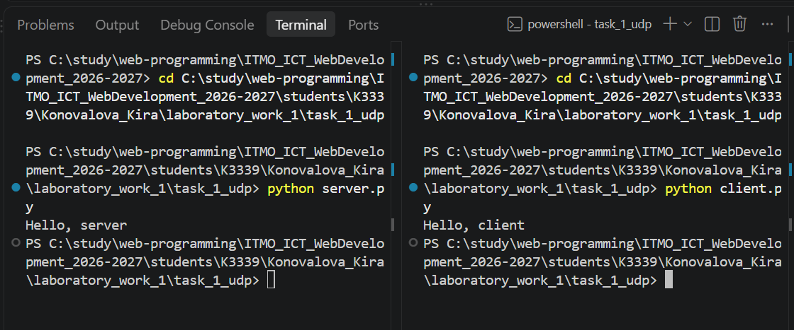
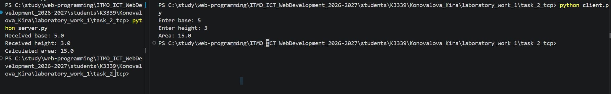
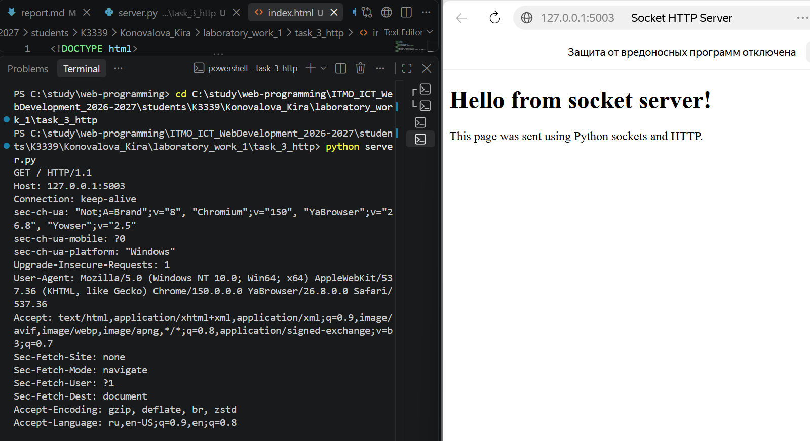
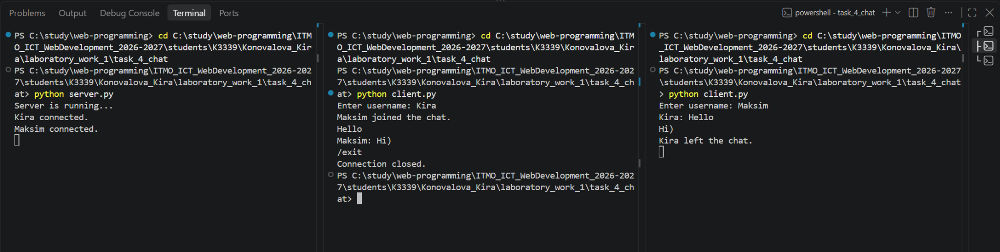

# Лабораторная работа №1. Работа с сокетами

## Цель работы
Понять принципы межсокетного взаимодействия в вебе и научиться реализовывать базовую клиент-серверную архитектуру

## Задание 1. Обмен сообщениями по UDP

### Описание

В первом задании реализовано клиент-серверное взаимодействие с использованием библиотеки `socket` и протокола UDP

UDP (User Datagram Protocol) — протокол без установления соединения. Перед отправкой данных клиент и сервер не устанавливают постоянное соединение друг с другом. Клиент отправляет отдельную датаграмму на IP-адрес и порт сервера, а сервер получает её и отправляет ответ на адрес клиента

Для взаимодействия используются:

- IP-адрес `127.0.0.1` — локальный адрес компьютера (`localhost`)
- порт `5001`
- `AF_INET` — использование IPv4
- `SOCK_DGRAM` — использование протокола UDP

### Серверная часть

Сервер создаёт UDP-сокет и связывает его с локальным IP-адресом и портом с помощью метода `bind()` (закрепляет сервер за IP и портом)

После этого сервер ожидает входящее сообщение методом `recvfrom()`. Метод возвращает полученные данные и адрес клиента. Полученные данные передаются в виде байтов, поэтому для получения строки используется метод `decode()`

После получения сообщения сервер отправляет клиенту ответ `Hello, client` методом `sendto()`

Код сервера:

```python
import socket

server_socket = socket.socket(socket.AF_INET, socket.SOCK_DGRAM)

server_address = ("127.0.0.1", 5000)
server_socket.bind(server_address)

data, client_address = server_socket.recvfrom(1024)

message = data.decode()
print(message)

response = "Hello, client"
server_socket.sendto(response.encode(), client_address)

server_socket.close()
```

### Клиентская часть

Клиент также создаёт UDP-сокет с использованием `AF_INET` и `SOCK_DGRAM`

Сообщение `Hello, server` преобразуется из строки в байты методом `encode()` и отправляется серверу методом `sendto()`

После отправки клиент ожидает ответ сервера с помощью `recvfrom()`. Полученные байты преобразуются обратно в строку методом `decode()` и выводятся в терминал

Код клиента:

```python
import socket

client_socket = socket.socket(socket.AF_INET, socket.SOCK_DGRAM)

server_address = ("127.0.0.1", 5000)

message = "Hello, server"
client_socket.sendto(message.encode(), server_address)

data, server_address = client_socket.recvfrom(1024)

response = data.decode()
print(response)

client_socket.close()
```

### Результат выполнения

Сначала был запущен сервер, который ожидал входящее UDP-сообщение. После запуска клиента сообщение `Hello, server` было отправлено серверу и отображено в его терминале

В ответ сервер отправил сообщение `Hello, client`, которое было получено и отображено в терминале клиента



Таким образом, клиент и сервер успешно обменялись сообщениями с использованием протокола UDP

## Задание 2. Вычисления через TCP

### Описание

Во втором задании реализовано клиент-серверное приложение с использованием протокола TCP. Клиент вводит параметры математической операции и отправляет их серверу. Сервер выполняет вычисление и возвращает результат клиенту

В соответствии с номером в журнале был выбран вариант 4 вычисление площади параллелограмма

Площадь параллелограмма вычисляется по формуле:

```text
S = a * h
```

где:

- `a` — длина основания параллелограмма;
- `h` — высота;
- `S` — площадь параллелограмма.

Для взаимодействия использовались:

- IP-адрес `127.0.0.1` — локальный адрес компьютера;
- порт `5002`;
- `AF_INET` — использование IPv4;
- `SOCK_STREAM` — использование протокола TCP.

В отличие от UDP, TCP предварительно устанавливает соединение между клиентом и сервером и обеспечивает надёжную передачу данных в правильном порядке

### Серверная часть

Сервер создаёт TCP-сокет с использованием `SOCK_STREAM`, связывает его с локальным IP-адресом и портом методом `bind()`, после чего переводится в режим ожидания подключений с помощью `listen()`

Метод `accept()` принимает входящее соединение клиента и создаёт отдельный сокет для взаимодействия с ним

Полученные данные считываются методом `recv()`, преобразуются из байтов в строку методом `decode()` и разделяются на основание и высоту параллелограмма. После вычисления площади результат преобразуется в строку, кодируется в байты и отправляется клиенту методом `send()`

Код сервера:

```python
import socket

server_socket = socket.socket(socket.AF_INET, socket.SOCK_STREAM)

server_address = ("127.0.0.1", 5002)
server_socket.bind(server_address)
server_socket.listen()

client_socket, client_address = server_socket.accept()

data = client_socket.recv(1024)
message = data.decode()

base, height = message.split()

base = float(base)
height = float(height)

area = base * height

print("Received base:", base)
print("Received height:", height)
print("Calculated area:", area)

client_socket.send(str(area).encode())

client_socket.close()
server_socket.close()
```

### Клиентская часть

Клиент создаёт TCP-сокет и устанавливает соединение с сервером методом `connect()`

Пользователь вводит основание и высоту параллелограмма. Эти значения объединяются в одну строку, преобразуются в байты методом `encode()` и отправляются серверу

После выполнения вычисления сервером клиент получает результат методом `recv()`, преобразует его в строку и выводит в терминал

Код клиента:

```python
import socket

client_socket = socket.socket(socket.AF_INET, socket.SOCK_STREAM)

server_address = ("127.0.0.1", 5002)
client_socket.connect(server_address)

base = input("Enter base: ")
height = input("Enter height: ")

message = base + " " + height
client_socket.send(message.encode())

data = client_socket.recv(1024)

print("Area:", data.decode())

client_socket.close()
```

### Результат выполнения

Для проверки работы программы были введены следующие значения:

```text
Основание: 5
Высота: 3
```

Сервер получил введённые параметры и вычислил площадь параллелограмма:

```text
S = 5 * 3 = 15
```

Клиент получил от сервера результат `15.0`



## Задание 3. Раздача HTML-страницы по HTTP

### Описание

В третьем задании реализован простой HTTP-сервер с использованием библиотеки `socket`

В качестве клиента используется браузер. При переходе по адресу `http://127.0.0.1:5003` браузер устанавливает TCP-соединение с сервером и отправляет HTTP-запрос

Пример первой строки запроса:

```text
GET / HTTP/1.1
```

Здесь:

- `GET` — HTTP-метод для получения ресурса;
- `/` — путь к запрашиваемому ресурсу;
- `HTTP/1.1` — версия протокола HTTP.

Сервер получает запрос, читает HTML-страницу из файла `index.html`, формирует HTTP-ответ и отправляет его браузеру

HTTP-ответ состоит из строки статуса, заголовков, пустой строки и тела ответа

Схема взаимодействия:


### HTML-страница

Содержимое страницы хранится в отдельном файле `index.html`

```html
<!DOCTYPE html>
<html lang="en">
<head>
    <meta charset="UTF-8">
    <title>Socket HTTP Server</title>
</head>
<body>
    <h1>Hello from socket server!</h1>
    <p>This page was sent using Python sockets and HTTP.</p>
</body>
</html>
```

### Серверная часть

Сервер создаёт TCP-сокет с помощью `AF_INET` и `SOCK_STREAM`, связывает его с локальным IP-адресом и портом методом `bind()` и начинает ожидать подключение методом `listen()`

После подключения браузера метод `accept()` принимает соединение и создаёт отдельный сокет для взаимодействия с клиентом

HTTP-запрос браузера принимается методом `recv()` и выводится в терминал

Затем сервер открывает файл `index.html`, считывает его содержимое и преобразует HTML-код в байты

Для корректного HTTP-ответа формируются следующие заголовки:

- `HTTP/1.1 200 OK` — запрос успешно обработан;
- `Content-Type: text/html; charset=utf-8` — тело ответа содержит HTML-страницу в кодировке UTF-8;
- `Content-Length` — размер тела ответа в байтах.

Между HTTP-заголовками и телом ответа добавляется пустая строка

Код сервера:

```python
import socket

server_socket = socket.socket(socket.AF_INET, socket.SOCK_STREAM)

server_address = ("127.0.0.1", 5003)
server_socket.bind(server_address)

server_socket.listen()

client_socket, client_address = server_socket.accept()

request = client_socket.recv(1024)
print(request.decode())

with open("index.html", "r", encoding="utf-8") as file:
    html = file.read()

html_bytes = html.encode("utf-8")
content_length = len(html_bytes)

response_headers = (
    "HTTP/1.1 200 OK\r\n"
    "Content-Type: text/html; charset=utf-8\r\n"
    f"Content-Length: {content_length}\r\n"
    "\r\n"
)

response = response_headers.encode("utf-8") + html_bytes

client_socket.sendall(response)

client_socket.close()
server_socket.close()
```

### Результат выполнения

Сервер был запущен на локальном адресе:

```text
http://127.0.0.1:5003
```

После перехода по данному адресу браузер отправил серверу HTTP GET-запрос

В терминале сервера был получен запрос, содержащий строку:

```text
GET / HTTP/1.1
```

Сервер загрузил содержимое файла `index.html`, сформировал HTTP-ответ и передал HTML-страницу браузеру

Браузер успешно отобразил полученную страницу



## Задание 4. Чат на сокетах

### Описание

В четвёртом задании реализован многопользовательский чат с использованием библиотеки `socket`, протокола TCP и библиотеки `threading`

В отличие от предыдущих заданий, сервер должен одновременно обслуживать несколько клиентов. Для этого каждое подключение обрабатывается в отдельном потоке

Пользователь запускает один и тот же файл клиента, вводит своё имя и после подключения может отправлять сообщения другим участникам чата

Сервер хранит активные клиентские подключения и имена пользователей, принимает сообщения от клиентов и рассылает их всем остальным участникам

Также реализована команда выхода из чата:

```text
/exit
```

После выхода клиента его соединение закрывается, а остальные пользователи получают сообщение о том, что он покинул чат

Для работы использовались:

- `AF_INET` — использование IPv4
- `SOCK_STREAM` — использование протокола TCP
- `threading` — создание отдельных потоков для одновременной работы с несколькими клиентами
- IP-адрес `127.0.0.1`
- порт `5004`


### Использование потоков

Для реализации многопользовательского режима используется библиотека `threading`

Основной поток сервера продолжает ожидать новые подключения, а для каждого подключившегося клиента создаётся отдельный поток

Это позволяет серверу одновременно работать с несколькими пользователями

Схематично работа сервера выглядит следующим образом:

```text
Основной поток сервера
        |
        |---- принимает Kira
        |         |
        |         └── отдельный поток Kira
        |
        |---- принимает Maksim
        |         |
        |         └── отдельный поток Maksim
        |
        └---- продолжает ждать новые подключения
```

### Серверная часть

Сервер создаёт TCP-сокет, связывает его с IP-адресом и портом с помощью `bind()` и переводит в режим ожидания подключений методом `listen()`

Для хранения подключённых пользователей используются два списка:

```python
clients = []
usernames = []
```

В список `clients` сохраняются клиентские сокеты, а в `usernames` — соответствующие им имена пользователей

Функция `broadcast()` используется для рассылки сообщения всем подключённым пользователям, кроме отправителя

Для каждого клиента создаётся отдельный поток, выполняющий функцию `handle_client()`. Она постоянно ожидает сообщения от конкретного пользователя и передаёт их другим участникам чата

При отключении пользователя его сокет и имя удаляются из списков, после чего остальные клиенты получают сообщение о выходе пользователя

Код сервера:

```python
import socket
import threading

server_socket = socket.socket(socket.AF_INET, socket.SOCK_STREAM)

server_address = ("127.0.0.1", 5004)
server_socket.bind(server_address)

server_socket.listen()

clients = []
usernames = []


def broadcast(message, sender_socket):
    for client in clients:
        if client != sender_socket:
            client.send(message)


def handle_client(client_socket):
    while True:
        try:
            message = client_socket.recv(1024)

            if not message:
                break

            broadcast(message, client_socket)

        except:
            break

    if client_socket in clients:
        index = clients.index(client_socket)

        clients.remove(client_socket)
        username = usernames[index]
        usernames.remove(username)

        client_socket.close()

        leave_message = f"{username} left the chat.".encode()
        broadcast(leave_message, client_socket)


def receive_clients():
    while True:
        client_socket, client_address = server_socket.accept()

        client_socket.send("USERNAME".encode())
        username = client_socket.recv(1024).decode()

        clients.append(client_socket)
        usernames.append(username)

        print(f"{username} connected.")

        join_message = f"{username} joined the chat.".encode()
        broadcast(join_message, client_socket)

        thread = threading.Thread(
            target=handle_client,
            args=(client_socket,)
        )
        thread.start()


print("Server is running...")
receive_clients()
```

### Работа функции `broadcast()`

Функция:

```python
def broadcast(message, sender_socket):
    for client in clients:
        if client != sender_socket:
            client.send(message)
```

перебирает все активные клиентские подключения

Условие:

```python
if client != sender_socket:
```

проверяет, что сообщение не отправляется обратно пользователю, который его написал

### Обработка клиента

Функция:

```python
handle_client()
```

работает в отдельном потоке для каждого подключённого клиента

В цикле:

```python
message = client_socket.recv(1024)
```

сервер ожидает сообщения пользователя

Если данные получены, сообщение передаётся функции:

```python
broadcast()
```

которая рассылает его другим клиентам

Если соединение закрывается или возникает ошибка, цикл завершается, пользователь удаляется из списка активных клиентов, а его сокет закрывается

### Подключение новых пользователей

Функция:

```python
receive_clients()
```

постоянно ожидает новые соединения методом:

```python
server_socket.accept()
```

После подключения сервер отправляет клиенту специальное сообщение:

```text
USERNAME
```

Клиент в ответ передаёт введённое пользователем имя

После этого сервер сохраняет сокет и имя:

```python
clients.append(client_socket)
usernames.append(username)
```

и запускает новый поток:

```python
thread = threading.Thread(
    target=handle_client,
    args=(client_socket,)
)

thread.start()
```

Таким образом, каждый клиент обрабатывается независимо от остальных пользователей

### Клиентская часть

Клиент создаёт TCP-сокет и подключается к серверу методом `connect()`

После запуска пользователь вводит своё имя

Для клиента также используется отдельный поток. Он постоянно принимает сообщения от сервера, пока основной поток программы позволяет пользователю вводить новые сообщения

Если от сервера приходит сообщение:

```text
USERNAME
```

клиент отправляет введённое имя пользователя

Все остальные сообщения выводятся в терминал

При вводе команды:

```text
/exit
```

клиент закрывает соединение с сервером и завершает работу

Код клиента:

```python
import socket
import threading

client_socket = socket.socket(socket.AF_INET, socket.SOCK_STREAM)

server_address = ("127.0.0.1", 5004)
client_socket.connect(server_address)

username = input("Enter username: ")


def receive_messages():
    while True:
        try:
            message = client_socket.recv(1024).decode()

            if message == "USERNAME":
                client_socket.send(username.encode())
            else:
                print(message)

        except:
            print("Connection closed.")
            client_socket.close()
            break


def send_messages():
    while True:
        message = input()

        if message == "/exit":
            client_socket.close()
            break

        full_message = f"{username}: {message}"
        client_socket.send(full_message.encode())


receive_thread = threading.Thread(target=receive_messages)
receive_thread.start()

send_messages()
```

### Параллельная работа клиента

У клиента одновременно выполняются две задачи:

```text
Основной поток
    |
    └── ввод и отправка сообщений

Дополнительный поток
    |
    └── получение сообщений от сервера
```

Функция:

```python
send_messages()
```

позволяет пользователю вводить сообщения

Функция:

```python
receive_messages()
```

работает в отдельном потоке и принимает сообщения от сервера

Благодаря этому клиент может получать новые сообщения, даже если пользователь в данный момент ничего не вводит

### Результат выполнения

Для проверки многопользовательского режима были запущены один сервер и два экземпляра одного и того же клиентского приложения



Таким образом, был реализован многопользовательский TCP-чат. Один сервер одновременно обслуживает несколько клиентов с помощью потоков, пользователи идентифицируются по имени, могут обмениваться сообщениями и корректно выходить из чата